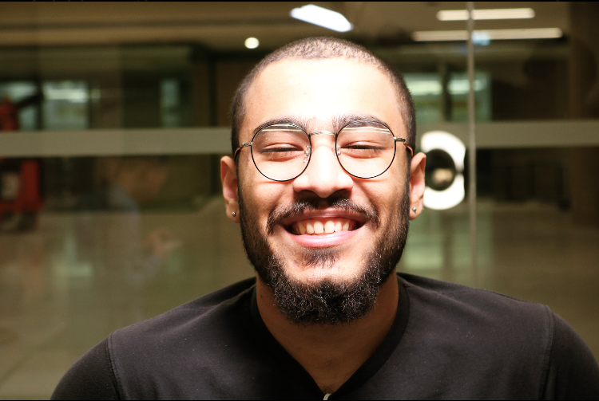

# Hashim Khan

## About Me 

Hi, my name is Hashim Khan and I am a second year Interactive Arts and Science student at Brock University. I am passionate about music, video games, sports and sound/video design!

## Blog Post

Drucker and Moretti, in their writings are trying to prove that visual expression is necessary when it comes to digital humanities [continue reading...](blog)

