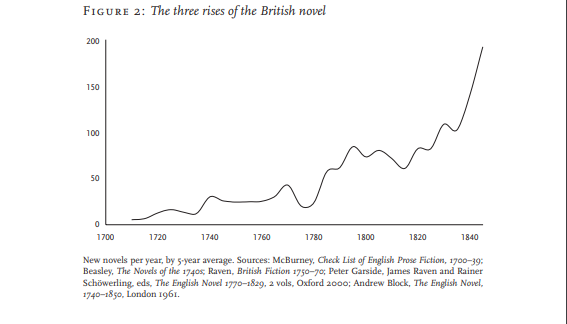

##Blog Post

Both Moretti and Drucker argue that visual forms (e.g. graphs, maps, etc.) can and should be used to represent cultural phenomena (e.g. the experience of temporality, rises and falls in genre, etc.). Moving between written and visual mediums of expression offers a model for the next generation of digital humanities scholarship, where readers are asked to think critically across both textual and graphical modes. As such, digital humanities scholarship should increasingly create multimodal scholarship where readers interpret both the text and any other media (such as graphs, images, audio, and so on). Creating scholarship that asks readers to interpret across multiple modes will distinguish digital humanities scholarship from scholarship in the sciences.

Drucker and Moretti, in their writings are trying to prove that visual expression is necessary when it comes to digital humanities. They argue that it provides a different perspective to look at data from and that can be valuable. I totally agree with Drucker and Moretti’s writing because I do feel that visual expression is a vital part of the digital humanities. It is the digital humanities and I feel that having visual aids such as graphs and images, adds a new perspective to the topic at hand. That is important because not only does it help to look at data from a different view, but that leads to making it easier to understand the data. I feel that when data is visualized, it leads to readers better understanding the data. That is the beauty of the digital humanities and those are some of the main concepts that Drucker and Moretti have tried to express.

In order to effectively analyze the point that Drucker and Moretti were trying to make, I took their respective writings and put them in a data visualization tool called Voyant. The illustration below one of the visualizations from Voyant, on Drucker. 

<!--	Exported from Voyant Tools (voyant-tools.org).
The iframe src attribute below uses a relative protocol to better function with both
http and https sites, but if you're embedding this into a local web page (file protocol)
you should add an explicit protocol (https if you're using voyant-tools.org, otherwise
it depends on this server.
Feel free to change the height and width values or other styling below: -->
<iframe style='width: 637px; height: 477px;' src='https://voyant-tools.org/tool/Cirrus/?corpus=7ce54010b05f90cd405ef31926256245'></iframe>

The visualization is pretty simple to understand. It has taken Drucker’s writings and it displays the most frequently used words in the writings. Just by looking at that, you can somewhat understand the point that Drucker is trying to get across. Graphical, data and information are some of the most frequently used words. That is because Drucker emphasizes on how visual aids can help portray greater information. Some other words that you can see in there are “interpretation”, “interpretive”, “view”, “subjective”, etc. All of these words are used to explain that data in the digital humanities is something that needs to be looked at in a subjective manner. It is not something that is strictly quantitative and only has one way to be understood. You have to look at it from different views and try to interpret it in a subjective way as different interpretations can change the meaning of the information. Drucker argues that graphical representations are a way that that can be done:

“My argument is a polemical call to humanists to think differently about the graphical expressions in use in digital environments. A fundamental prejudice, I suggest, is introduced by conceiving of data within any humanistic interpretative frame on a conventional, uncritical, statistical basis.” - (Drucker. 2011)

Moretti makes a very similar argument as Drucker’s. Moretti, in his book “Graphs, Maps, Trees” uses graphs to represent information about novels and novel production. The point that Moretti is trying to make is that using visual representations like graphs, can help better understand information by looking at it from this new, different perspective. Something very similar to what Drucker said. 

Moretti starts by using a graph to illustrate the production of new novels per year, by a 5-year average, in Britain. The graph can be seen below:

The graph itself is just simple spikes that represent the change in the number of new novels produced as the years go. However, Moretti then uses similar graphs to analyze the production of novels in other countries to see if there are any correlations. Moretti then also uses graphs to represent economic information in Britain over the same period of time. At the end, Moretti uses the data from all the graphs and is able to draw links and correlations between and can better understand the reasoning behind the spikes in the original graph. Moretti does this to prove that using graphs as visual aids when representing information, are necessary because they allow you to look at the data from a different view, a view that simple text representation might not be able to portray, and then, hence, leads to a better understanding of the information.

[Click here](index.html) to go back
